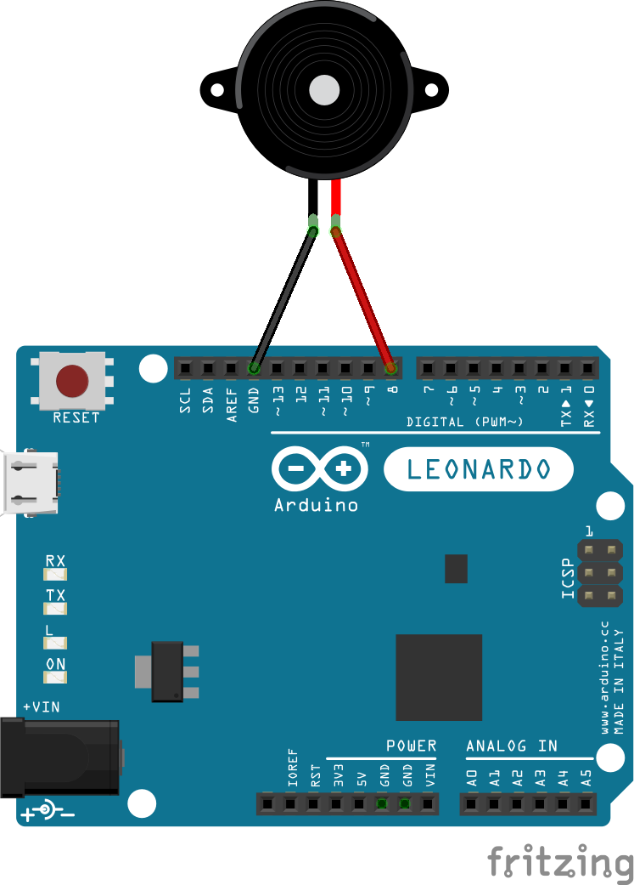

# ArduinoMorseEncoder

This is an object oriented based approach to creating a morse code encoder for Arduno

Simply connect your Arduino board to your computer via the relevant USB cable and upload the sketch to your Arduino board.
Once completed you can open up the Arduino IDE Serial Monitor window and type a message in the field provided followed by enter (or pressing the send button). The Arduino then outputs morse code via the three morse code encoders, namely LED, Serial and Speaker.

The abstract type "Morse" provides a mechanism for creating different types of morse code encoders.
I have provided three types already:
1. LedMorse - outputs the morse code as a light signal.
2. SpeakerMorse - outputs a 1kHz signal to a speaker or buzzer connected to pin 8 on your Arduino board.
3. SerialMorse - outputs the morse code dot and dash notation back to your Serial Monitor window. e.g. SOS results in ... --- ... being output.

The CompositeMorse type implements the GoF Composite pattern allowing multiple Morse types to be added. at once.

Connecting a buzzer to pin 8 of the Arduino board...

